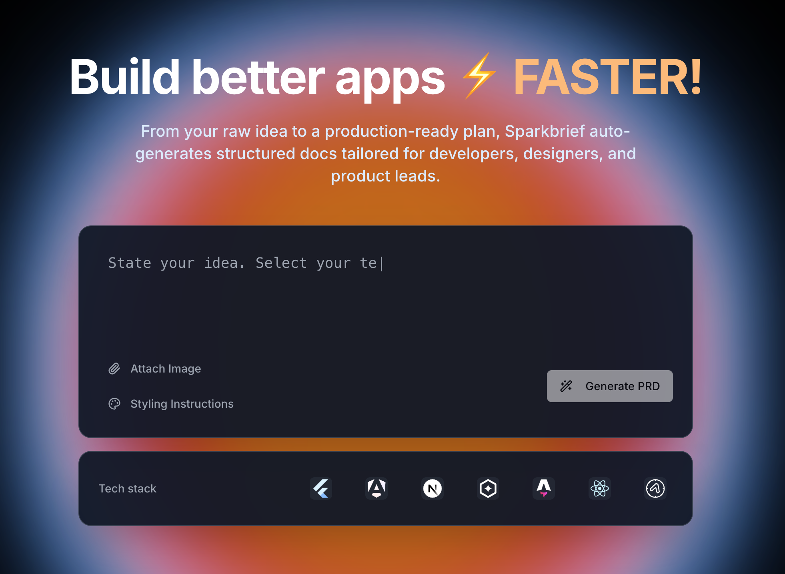

# SPARKBRIEF.IO
### *Brief Today. Build Tomorrow.*

  

  <h2>🚀 AI-Powered PRD Generator for Modern Product Teams</h2>
  
<strong>Transform ideas into professional Product Requirements Documents in minutes, not hours</strong>

  
  
  

---

## 🎯 **What is Sparkbrief?**

**SPARKBRIEF** is the AI-powered PRD generator that gets it. Whether you're a PM grinding through enterprise requirements, a creative vibecoder with the next big app idea, or a technical lead tired of translating code into business-speak, Sparkbrief transforms your brain dumps into professional, comprehensive Product Requirements Documents that actually make sense.

Generate investor-ready documentation, technical specifications, and team-aligned requirements—all powered by AI and optimized for your workflow.

> **🔥 Ready to accelerate your product workflow?**  
> **[Start your free trial at www.sparkbrief.io →](https://www.sparkbrief.io)**

---

## 📸 **See Sparkbrief in Action**

  
<em>Watch how our AI transforms a simple product idea into a comprehensive PRD with technical specifications, user stories, and acceptance criteria—all in under 3 minutes.</em>

  
  <!-- PLACE YOUR APP SCREENSHOTS HERE -->

  

  
  
<strong>From idea to professional documentation in minutes, not hours.</strong>

---

## ✨ **Key Features**

| Feature | Description |
|---------|-------------|
| 🤖 **8-Step AI Generation** | Comprehensive PRDs covering product vision, technical architecture, user stories, and acceptance criteria |
| 📄 **Multi-Format Export** | Download as Markdown, HTML, PDF, or structured JSON—perfect for any workflow or AI coding agent |
| ⚙️ **Technical Specifications** | Auto-generated API specs, database schemas, and system architecture diagrams |

---

## 🎯 **Built for Modern Product Teams**

Sparkbrief understands that different roles need different approaches to product documentation. Our AI adapts to your persona and workflow:

<table>
  <tr>
    <td width="50%" valign="top">
      <h3>👔 Traditional Product Managers</h3>
      <ul>
        <li>Enterprise-ready PRDs with compliance and audit trails</li>
        <li>Simple ROI calculations and business metrics</li>
        <li>Integration specs for existing tool stacks</li>
        <li><em>Perfect for regulated industries and large teams</em></li>
      </ul>
    </td>
    <td width="50%" valign="top">
      <h3>🎨 Creative "Vibecoders"</h3>
      <ul>
        <li>Turn creative concepts into professional documentation</li>
        <li>Visual-first approach with design considerations</li>
        <li>Bridge creative vision with technical requirements</li>
        <li><em>From indie app ideas to startup MVPs in just an hour!</em></li>
      </ul>
    </td>
  </tr>
</table>

---

## 🚀 **Why Teams Choose Sparkbrief**

<table>
  <tr>
    <td align="center" width="33%">
      <h3>⚡ Speed & Efficiency</h3>
      <ul>
        <li>Generate complete PRDs in 2-3 minutes</li>
        <li>Instant from idea to creation feeling</li>
        <li>Perfect guidelines for AI powered coding systems</li>
      </ul>
    </td>
    <td align="center" width="33%">
      <h3>🎯 Professional Quality</h3>
      <ul>
        <li>Comprehensive technical specifications</li>
        <li>Ready for integration with Lovable or Bolt.</li>
        <li>Enhance your workflow, experience less hallucinations!</li>
      </ul>
    </td>
    <td align="center" width="33%">
      <h3>🔧 Developer Friendly</h3>
      <ul>
        <li>Machine-readable outputs for AI agents</li>
        <li>Compatible with VS Code, Cursor, Kilo, etc</li>
        <li>Export to any format your team needs</li>
      </ul>
    </td>
  </tr>
</table>

---

## 🌐 **Get Started Today**

  
  **Ready to transform your product development workflow?**  
  Join us on our journey where we already accelerated our own documentation process with AI.

  ### **[🚀 Start Your Free Trial → www.sparkbrief.io](https://www.sparkbrief.io)**

  ✅ No credit card required • ✅ Generate your first PRD in under 10 minutes • ✅ Free tier available

---

## 🤝 **Support & Community**

Questions about implementing Sparkbrief in your workflow? Want early access to new features?

- 📧 **Email:** [info@sparkbrief.io](mailto:info@sparkbrief.io)
- 🐛 **Issues:** [GitHub Community](https://github.com/nuttyproducer/sparkbrief.io/issues)
- 🐦 **Twitter:** [@sparkbrief](https://x.com/sparkbrief)
- 📝 **Helpcenter:** [blog.sparkbrief.io](https://sparkbrief.io/help)

---

  
<em>SPARKBRIEF © 2025 by NuttyProducer. All rights reserved.</em>

  
<strong>Built with ❤️ for modern product teams.</strong>

